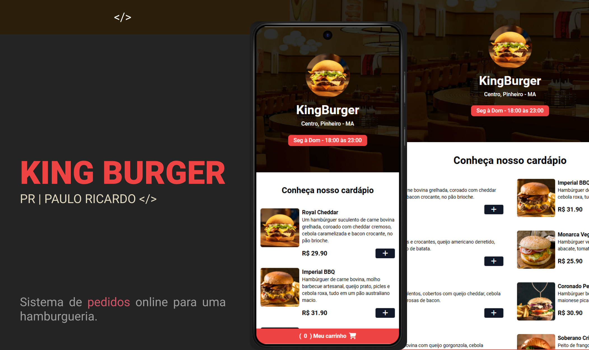

# Hamburgueria

Uma aplicação web para realizar pedidos de hambúrgueres e bebidas.

## Descrição

Esta aplicação foi desenvolvida como parte de um desafio do canal **Sujeito Programador** no YouTube, criado por Matheus. Ela atende à necessidade de um sistema de pedidos online para uma hamburgueria. Os pedidos realizados pelos usuários são enviados diretamente via WhatsApp utilizando uma API gratuita, com validação automática do horário de funcionamento (disponível das 18h às 23h).

## Funcionalidades

- **Pedido online**: Envio direto para o WhatsApp da hamburgueria.
- **Validação de horário**: O sistema aceita pedidos apenas dentro do horário de funcionamento.
- **Alertas visuais**: Utiliza Toastify para exibir mensagens e notificações de forma amigável.

## Tecnologias Utilizadas

- **HTML**: Para a estrutura da página.
- **Tailwind CSS**: Para estilização eficiente e responsiva.
- **JavaScript**: Para a lógica de validação e integração com APIs.

## Como Executar

1. Certifique-se de que você tem o Live Server instalado em seu editor de código.
2. Abra o arquivo principal (`index.html`) no seu editor.
3. Execute o Live Server para abrir a aplicação no navegador.

## 📄 Licença

- MIT License
- Este projeto é de uso livre e pode ser modificado ou integrado em outros projetos.